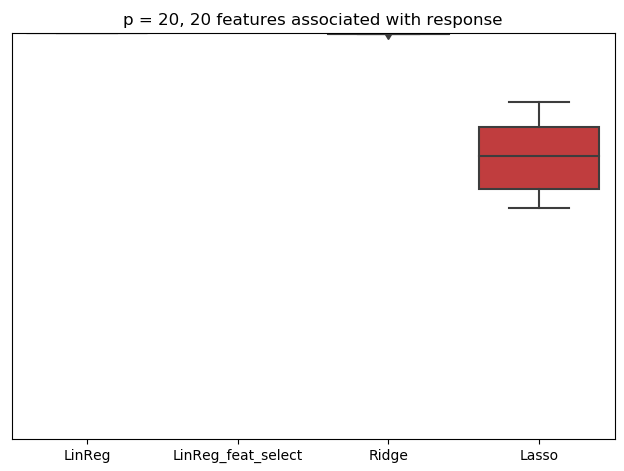
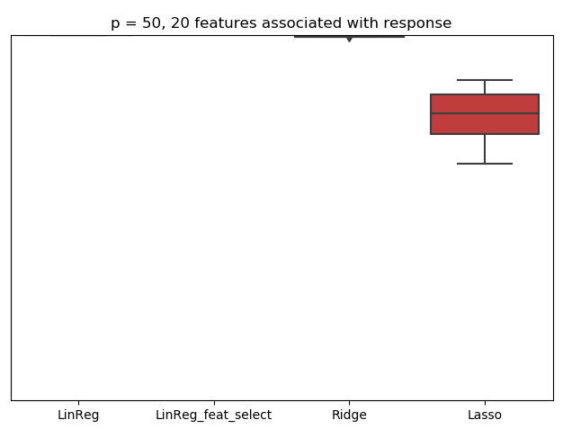
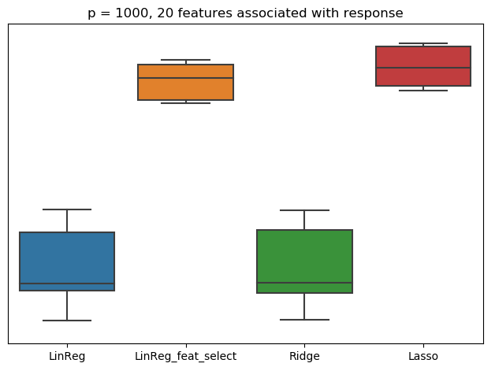

# Regularization

Show with boxplots the prediction accuracy of Ridge, Lasso, LinearRegression and LinearRegression with feature selection in a dataset of 20, 50 and 1000 paramaters with n=200 given that only 20 features are associated with the response

acc = 0.99.., 0.54, 0.98..., 0.96..

acc = 0.99.., 0.54, 0.99..., 0.99..

acc = 0.75.., 0.97, 0.74..., 0.99..

We see that LASSO performs better only when a lot of features are not useful, same for linear regression with feature selection.
As expected feature selection with linear regression performs really badly when all features are important, even when more than half of the variables are noise (though we didn't use grid search in this example). In comparison to linear regression with feature selection, Lasso seems to perform quite well almost all the time.
