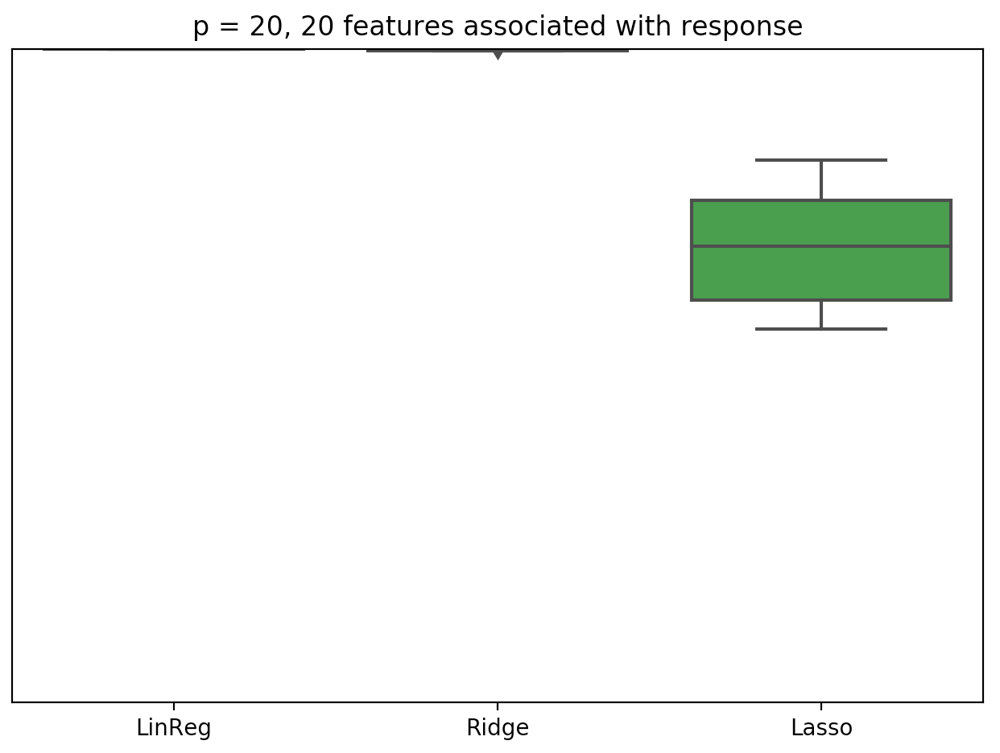
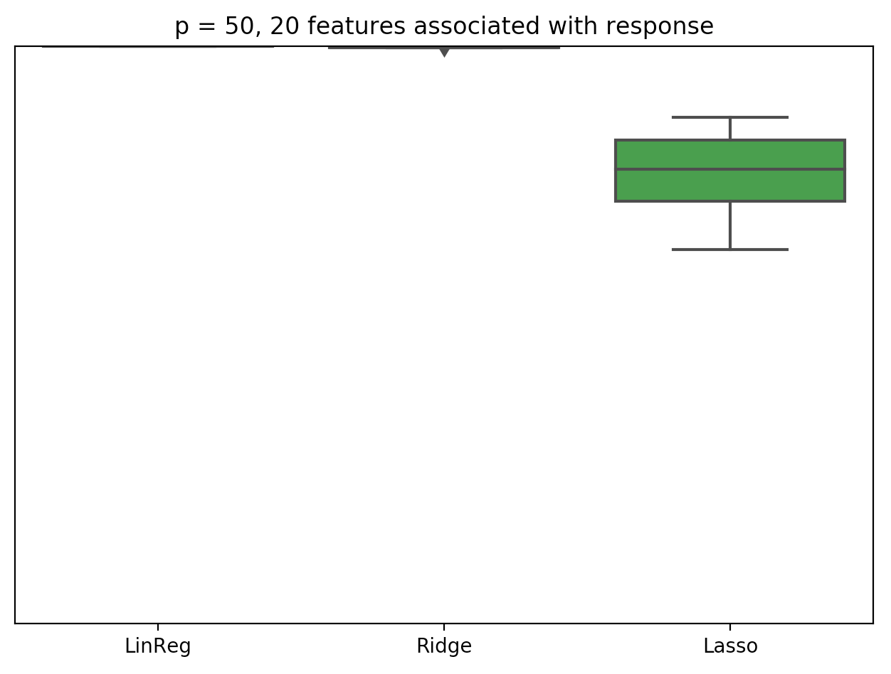
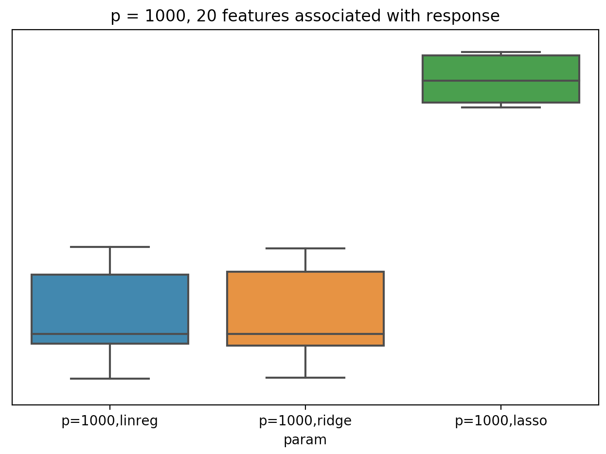

# Regularization

Show with boxplots the prediction accuracy of Ridge, Lasso and LinearRegression in a dataset of 
20, 50 and 1000 paramaters with n=200 given that only 20 features are associated with the response

We see that LASSO perform better only when a lot of features are not useful
